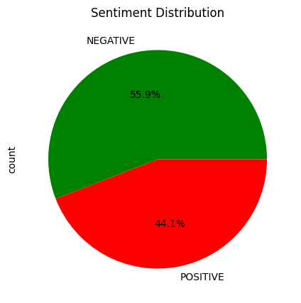

# 🧠 Twitter Sentiment Analysis using Transformers

Analyzed 300+ tweets about **AI Tools** using a pre-trained NLP model (**DistilBERT**) on **Google Colab**.  
Goal: Understand public opinion on AI tools — excitement vs. concern.

---

## 📊 Sentiment Results
🟢 **Positive:** 44%  
🔴 **Negative:** 56%

  

---

## 🧰 Tools & Libraries
- Python (Google Colab)
- Transformers (Hugging Face)
- Pandas, Matplotlib, Seaborn

---

## 💻 Run the Notebook

---

## 🔍 Key Insight
> The analysis found that public sentiment about AI tools is slightly more negative (56%) than positive (44%).  
> Positive tweets highlight innovation and creativity, while negative tweets mention privacy and job concerns.

---

## 📈 Visualization

---

## 🧑‍💻 How to Run
1. Open `sentiment_analysis.ipynb` in Google Colab  
2. Run all cells to re-generate results and plots  
3. Modify search keywords to analyze any topic you want  

---

**Author:** Vishwas 
**Date:** October 2025  
**License:** MIT
